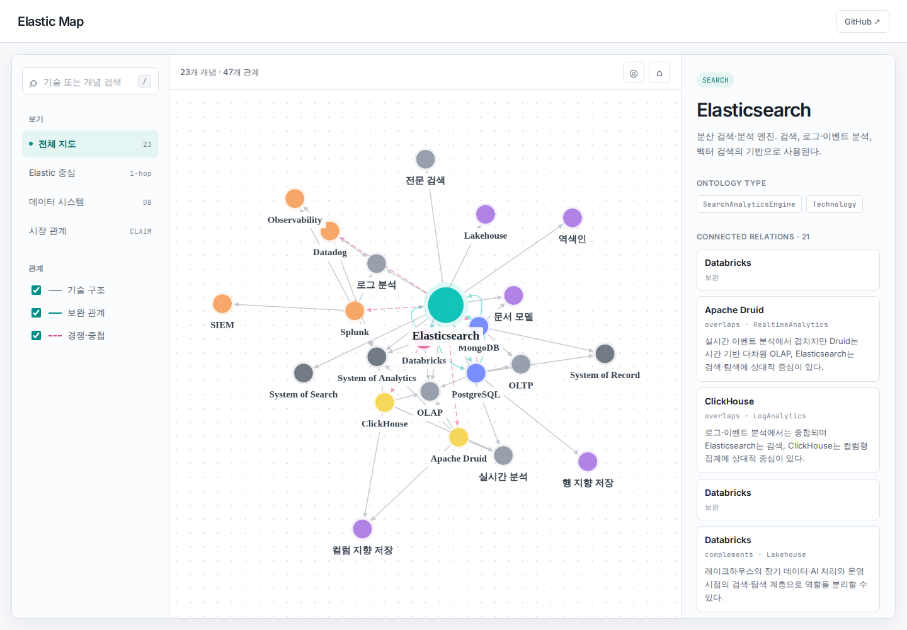

# Elastic Map

> Elastic을 중심으로 데이터베이스, 검색, 분석, 관측성, 보안 기술의 관계와 시장 위치를 탐색하는 확장형 기술 온톨로지입니다.

[](https://github.com/WnyTechPublic/elastic-map/actions/workflows/validate.yml)

**Live:** https://pub.wnytech.co.kr/elastic-map/



## 왜 Elastic Map인가

`elastic`은 Elastic 제품군과 변화에 따라 탄력적으로 확장되는 지도를 함께 뜻합니다. 이 프로젝트는 제품 순위표가 아니라 서로 다른 층위의 개념을 분리하고, 특정 맥락에서의 보완·중첩·경쟁 관계를 근거와 기준일과 함께 기록합니다.

## 원칙

1. **층위 분리** — 워크로드, 아키텍처 패턴, 엔진, 플랫폼, 시스템 역할을 구분합니다.
2. **맥락화된 시장 관계** — `경쟁한다`는 절대 사실이 아니라 사용 사례와 기준일을 가진 `PositioningClaim`으로 모델링합니다.
3. **사실과 해석의 분리** — 제품 정의는 공식 문서에 연결하고 시장 포지셔닝은 별도 평가로 기록합니다.
4. **Git이 원본** — 초기에는 DB 없이 Turtle 파일을 canonical source로 사용합니다.

## 구조

```text
ontology/elastic-map.ttl   OWL 의미 체계를 Turtle로 표현한 공식 원본
scripts/build_graph.py     Turtle → 브라우저용 JSON 변환
site/                      정적 인터랙티브 웹사이트
tests/                     온톨로지 완전성과 빌드 검증
docs/methodology.md        모델링 방법과 검토 기준
```

## 로컬 실행

```bash
python3 -m venv .venv
. .venv/bin/activate
pip install -r requirements-dev.txt
python scripts/build_graph.py
python -m http.server 8080 --directory site
```

브라우저에서 `http://localhost:8080`을 엽니다.

## 검증

```bash
. .venv/bin/activate
pytest
python scripts/build_graph.py
node --check site/app.js
```

## 현재 범위

- 핵심: Elasticsearch
- 워크로드: OLTP, OLAP, 전문 검색, 로그 분석, 실시간 분석, Observability, SIEM
- 인접 기술: PostgreSQL, MongoDB, ClickHouse, Apache Druid, Databricks, Splunk, Datadog
- 아키텍처: Lakehouse, 역색인, 행 지향, 컬럼 지향, 문서 모델

## 라이선스 및 상표

코드는 MIT License로 제공합니다. 제품명과 상표는 각 소유자의 자산입니다. 본 프로젝트의 시장 관계 설명은 기준일 현재 공개 자료에 기반한 WnyTech의 분석이며 각 벤더의 공식 비교 또는 보증을 의미하지 않습니다.
